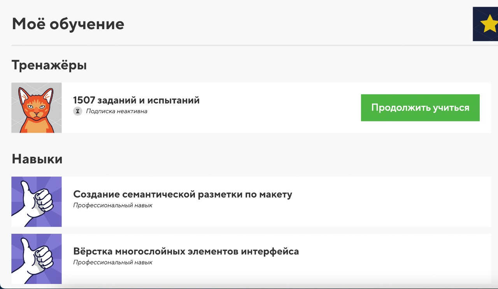

# Anna Paukaeva
*Junior Frontend Developer*

## Contact information:
*Want to know more or just chat?
You are welcome!*
- Phone: +995 591 949 856
- E-mail: annpaukaeva@gmail.com
- Telegram: [@APaukaeva](https://t.me/APaukaeva)
- LinkedIn: [Anna Paukaeva](https://www.linkedin.com/in/paukaeva/)
- Discord: Anna Paukaeva (@paukaeva)

---

## About me 
Hi, I'm Anna – Junior Frontend Developer from Saint Petersburg. I'm interested in web and mobile development and everything connected with it.
I'm studying at course "JS/FRONT-END" in [RS School](https://rs.school/). 
Ready to implement excellent projects with enthusiastic people.

---

## Skills
- HTML/CSS
- JS/React (Basic)
- Git/[GitHub](https://github.com/paukaeva?tab=repositories)
- VSCode
- Figma
- Jira

---

## Portfolio
- [Cake Buro](https://cakeburo.ru/) - Semantic HTML markup and CSS styling

- [Skillary](https://github.com/paukaeva/Skillary-UI-Kit) - Developed UI Kit components for a mobile app on React Native


---

## Code Example
```
    const MOCKUP_DATA = [
      { title: 'Физическое развитие', points: 300, type: SKILL_TYPES.PHYSICAL },
      { title: 'Интеллект', points: 450, type: SKILL_TYPES.INTELLIGENCE },
      { title: 'Окружающий мир', points: 500, type: SKILL_TYPES.WORLD },
      { title: 'Творчество', points: 650, type: SKILL_TYPES.CREATION },
      { title: 'Лидерство', points: 250, type: SKILL_TYPES.LEADERSHIP },
      { title: 'Социальный успех', points: 300, type: SKILL_TYPES.SOCIAL },
      { title: 'Практические навыки', points: 450, type: SKILL_TYPES.PRACTICAL },
    ]

    const ListOfSkills = () => {
      return (
        <FlatList
          data={MOCKUP_DATA}
          ItemSeparatorComponent={() => <View style={styles.separator} /> }
          renderItem={({ item }) => (
            <View style={styles.itemContainer}>
              <SmallMedalIcon />
              <View style={styles.titleContainer}>
                <Text style={styles.titleText}>{item.title}</Text>
              </View>
              <View style={styles.progressContainer}>
                <View style={[
                  styles.progressOpacity,
                  { backgroundColor: getColorByType(item.type)},
                ]}/>
                <View style={[
                  styles.progressValue,
                  {
                    width: DeviceLayout.getSize((190 / 100) * (item.points / 10)),
                    backgroundColor: getColorByType(item.type),
                  },
                ]}
                >
                  <Text style={styles.pointsText}>{item.points}</Text>
                </View>
              </View>
              <BigMedalIcon />
            </View>
          )}
        />
      )
    }
```

---

## Courses
#### HTML Academy


---

## English
B1 (Intermediate)